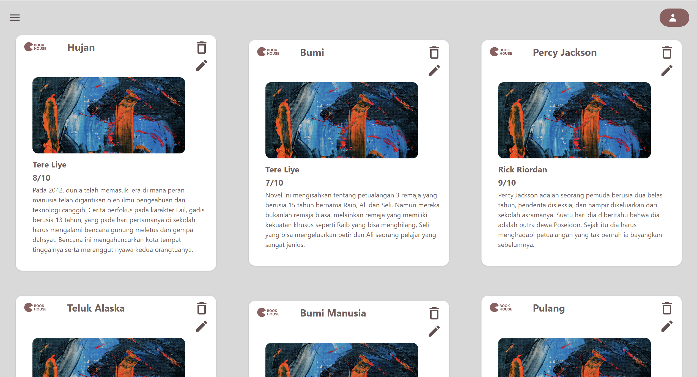
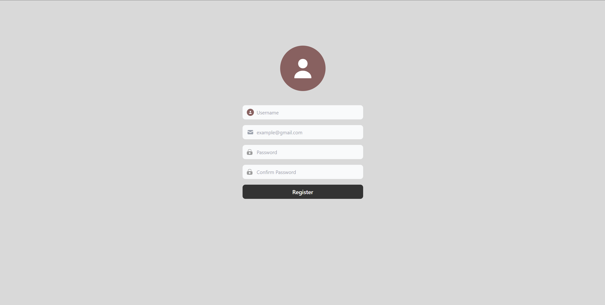
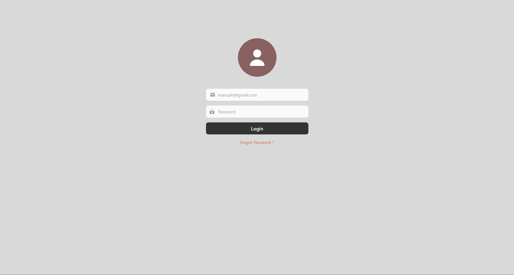
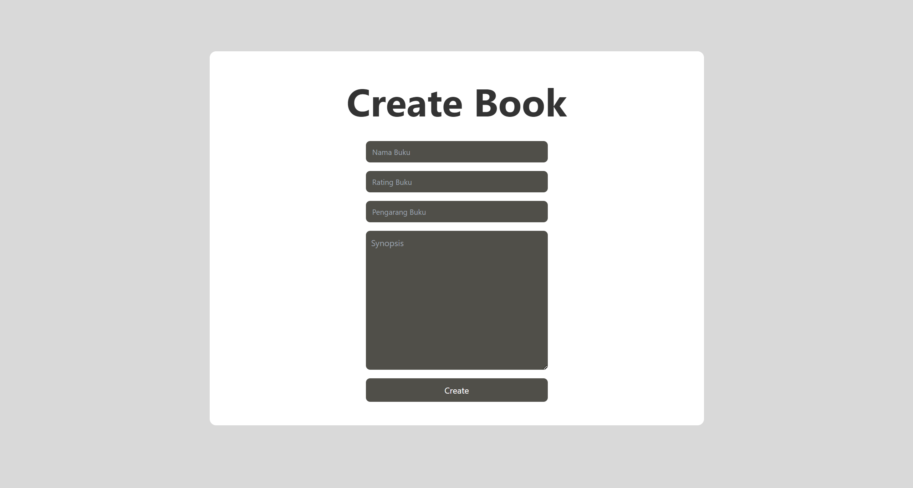
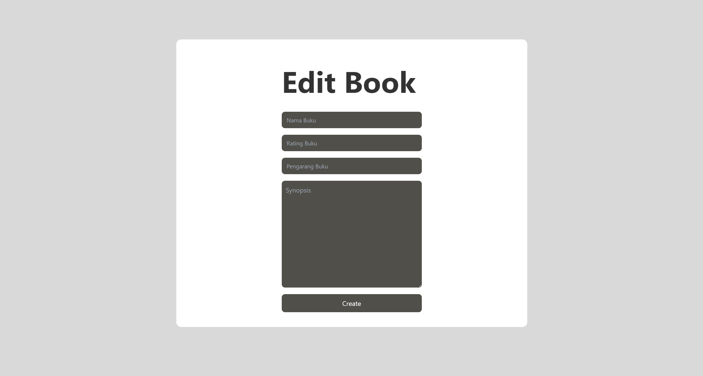

# BookHouse
Klik link di bawah ini untuk melihat web BookHouse

- [Book House](https://housebook.wazwazz.my.id/)

## About BookHouse
BookHouse adalah web yang dipergunakan untuk mencari buku atau novel favorite yang di ukur dengan berdasarkan rating pembaca.

## Features BookHouse

- Create data
- edit data
- delete data
- middleware (Admin : Can edit, delete, create), (Visitors : just see)
- login, register, & log out

## Documentation

- Diatas ini adalah HomePage dari web BookHouse

- Diatas ini adalah Library dari BookHouse

- Diatas ini adalah Form register dari web BookHouse

- Diatas ini adalah Form login dari web BookHouse

- Diatas ini adalah Form create bagi admin untuk menambahkan Buku

-Diatas ini adalah Form edit bagi admin untuk mengedit buku yang sudah ada

