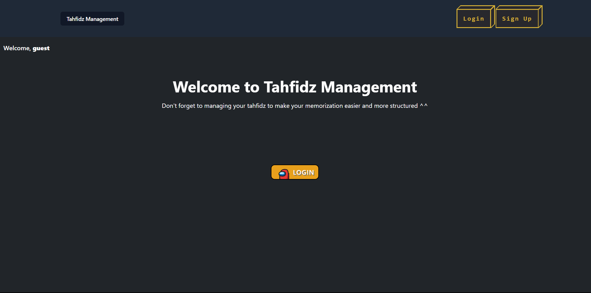
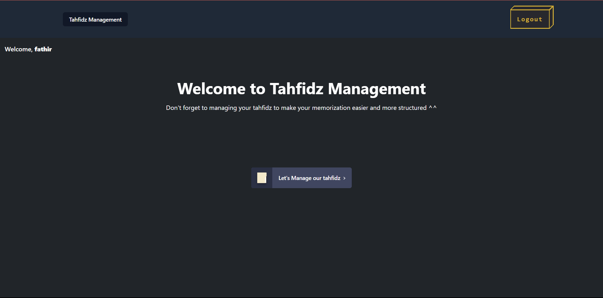
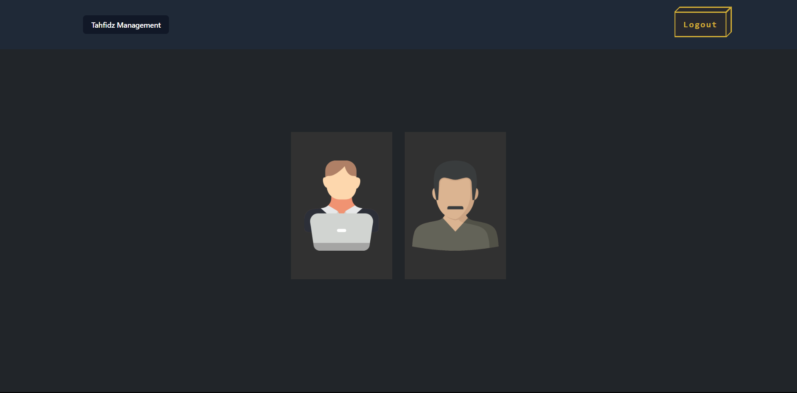
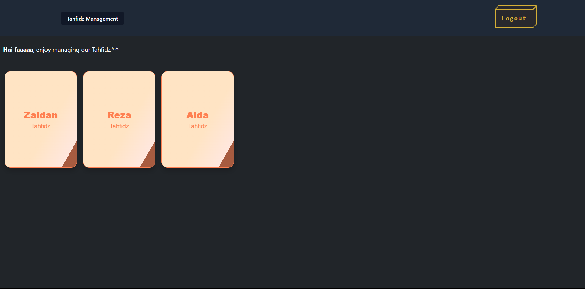
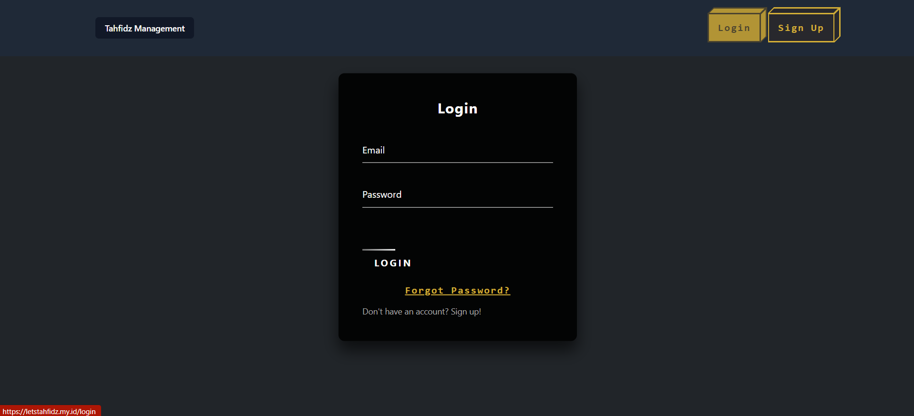
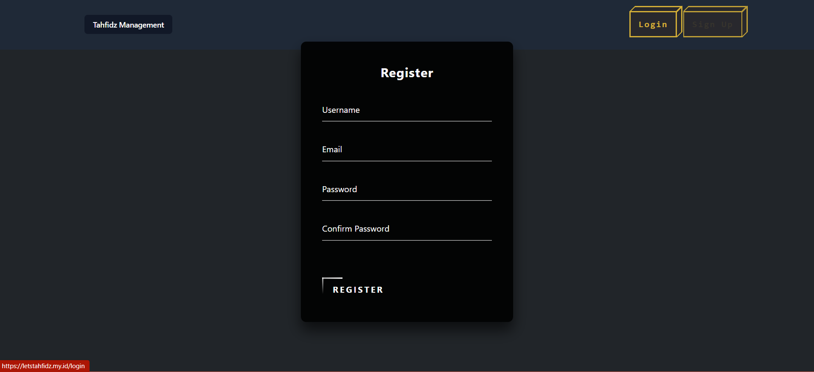

# Let's Tahfidz
[letstahfidz.my.id](letstahfidz.my.id)

Tahfidz management website untuk memanage tahfidz yang berguna untuk seorang pengampuh memanage muridnya yang nantinya setelah murid tersebut setoran bakal ditulis hafalan terkini jadi tidak akan lupa hafalan per anak sampai mana dan yang nantinya bisa dilihat oleh para murid.

## Features

- CRUD Data setoran siswa
- Autentikasi beserta validasi input
- Admin role (bisa mengatur setoran murid)
- Admin view
- User View
- Verify email
- Dashboard
## Documentation

**Tampilan Utama**

**Tampilan Dashboard**

**Tampilan Daftar Tahfidz**

**Tampilan Admin**

**Login & Register**

