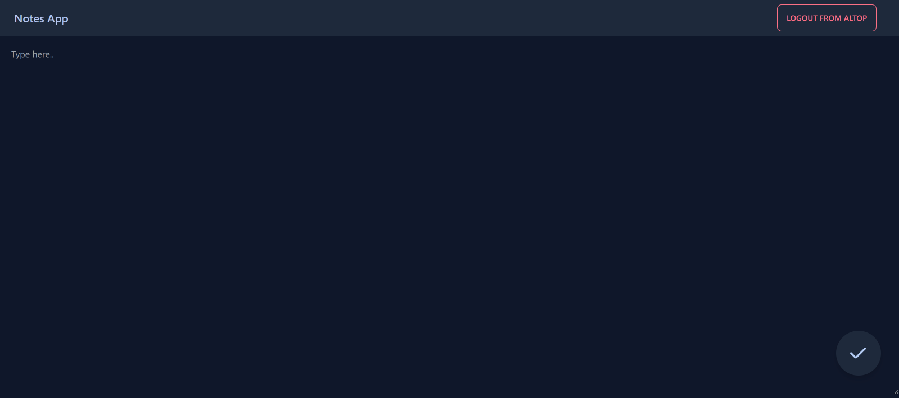

## Notes App
Link Website Notes : https://notes.althaf-budiman.my.id/
Link Website Tasks : https://tasks.althaf-budiman.my.id/

## Deskripsi : 
Ini adalah aplikasi catatan bersama berbasis website dengan ui dan ux yang baik, ada 2 role yaitu user dan admin.

## Fitur-fitur :
Di aplikasi ini anda bisa membuat, melihat, mengedit, dan menghapus catatan dengan ui dan user experience
yang baik. Di aplikasi ini anda bisa register untuk membuat akun agar bisa login ke aplikasi.
Di aplikasi ini ada 2 Role yaitu : User dan Admin. Admin mempunyai fitur khusus yaitu fitur untuk melihat user yang telah terdaftar di dalam aplikasi.

## Images :

*Ini adalah halaman register untuk membuat akun di aplikasi ini, ada beberapa yang harus diisi yaitu: nama, email, password, dan konfirmasi password*

*Ini adalah halaman welcome yang akan ditunjukkan saat pertama kali masuk aplikasi, juga menampilkan user yang sedang login sekarang*

*Ini adalah halaman index yang menampilkan catatan-catatan yang telah dibuat, lalu kita juga bisa klik ke notes yang sudah dibuat untuk masuk ke mode edit, kita juga bisa membuat catatan baru dengan klik tombol berlogo kertas dengan pulpen di kanan bawah*

*Ini adalah halaman membuat catatan, disini kita bebas mengetik apa saja sesuai kebutuhan, lalu jika sudah selesai tinggal klik tombol centang di kanan bawah, lalu kita masukkan judul untuk catatan maka akan terbuat catatan baru*