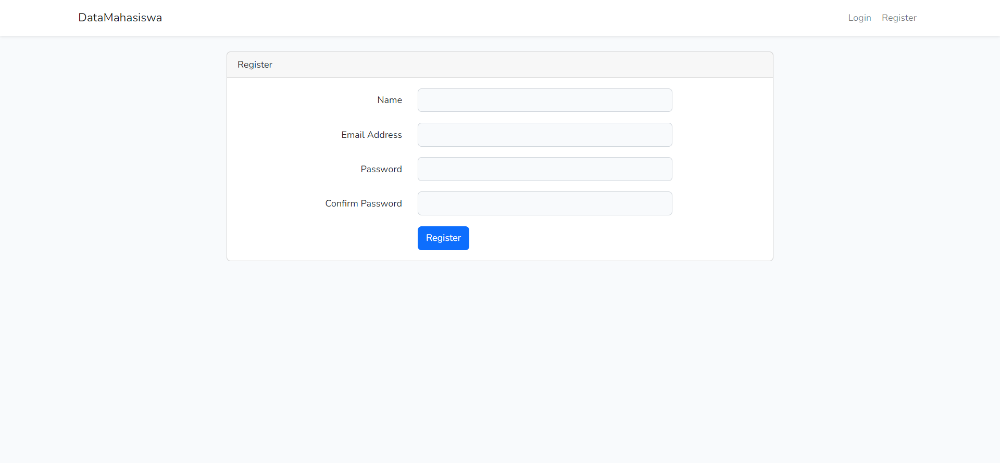
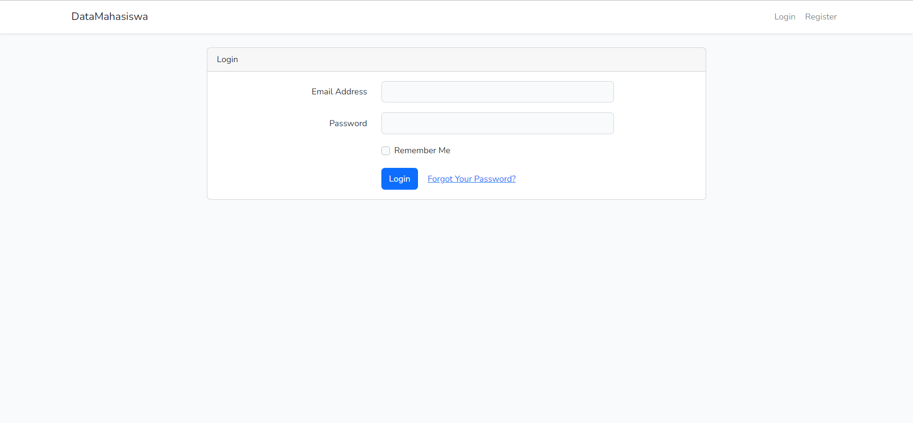
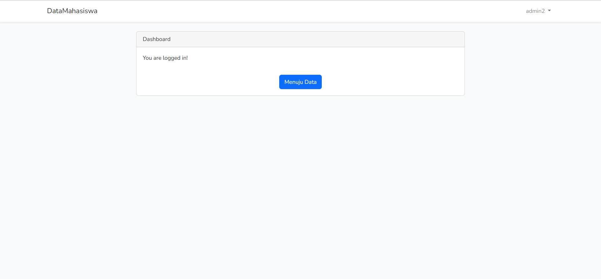
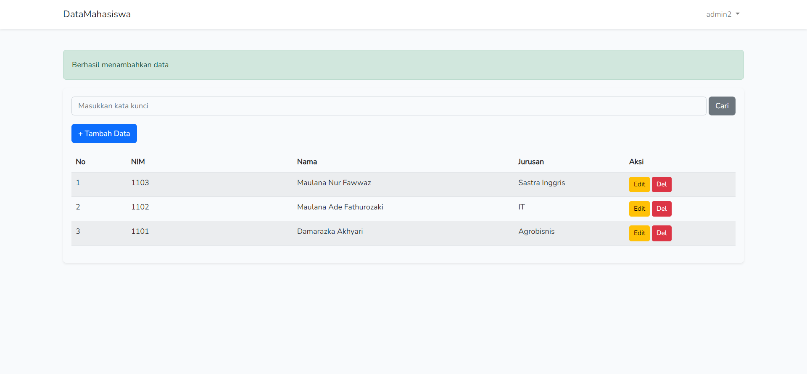
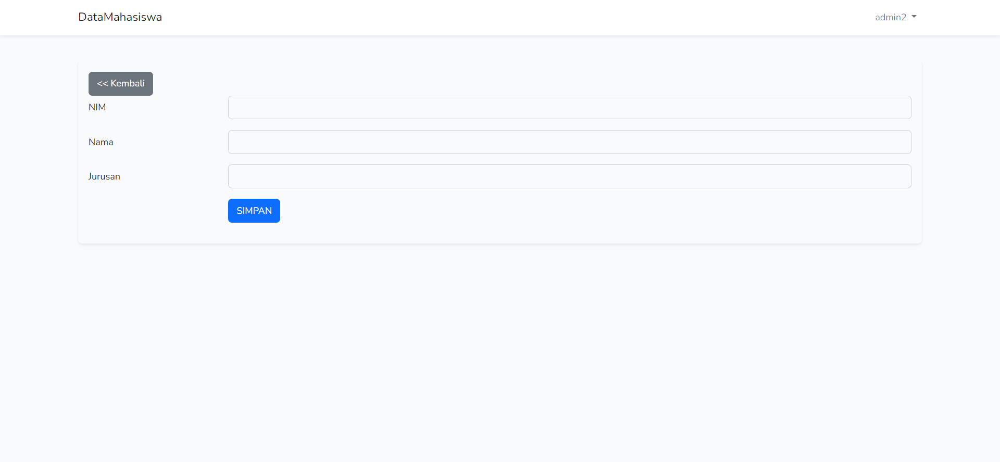
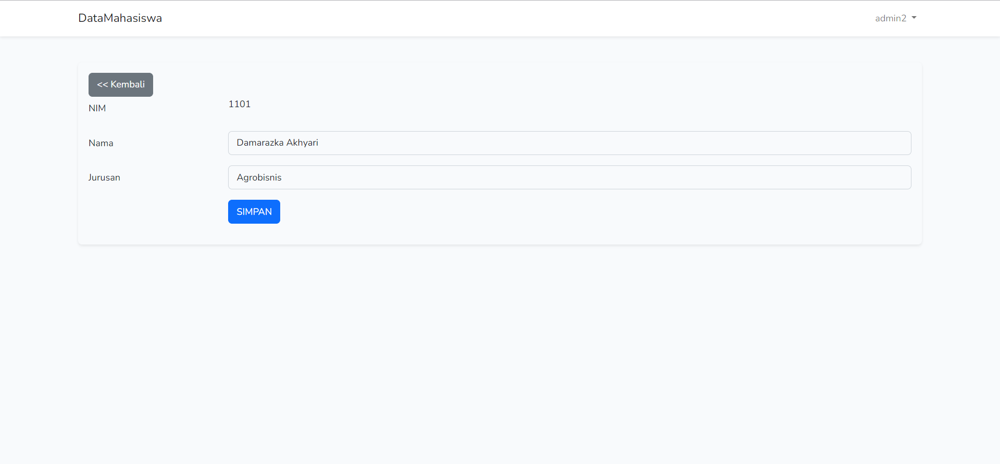
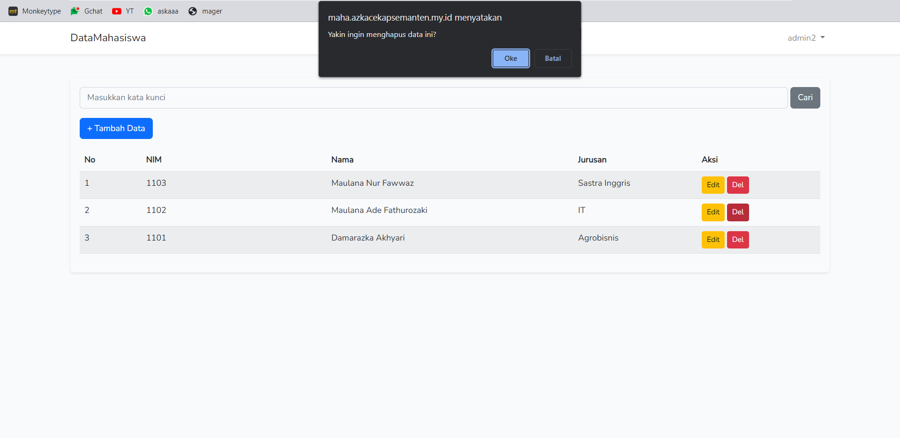
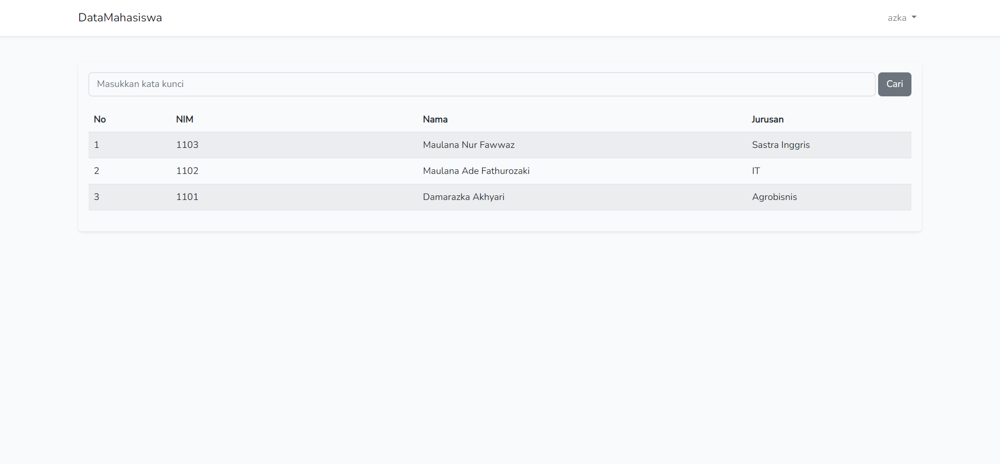

# Nama Aplikasi : Data Mahasiswa.

Link Web Sendiri : https://maha.azkacekapsemanten.my.id/

Link Web Ngobar  : https://task.azkacekapsemanten.my.id/

Deskreipsi Aplikasi : Web untuk mendata data dari mahasiswa yang mana berdasarkan NIM, Nama Mahasiswa, dan Jurusan.

## Fitur-fitur Web : 

 1. CRUD  
 2. Search
 3. Auth
 4. jika bukan Admin tidak bisa melakukan (Create, Update, dan Delete) hanya bisa 
    melihat data yang ada.

## Dokumentasi Aplikasi : 

## My Poster :  

