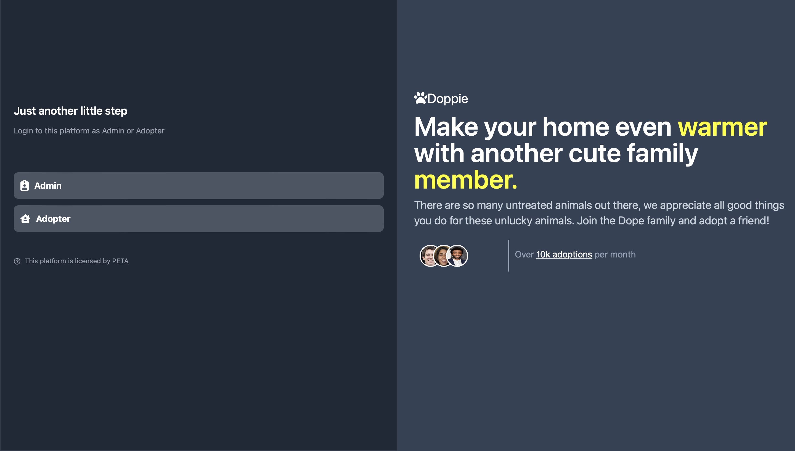
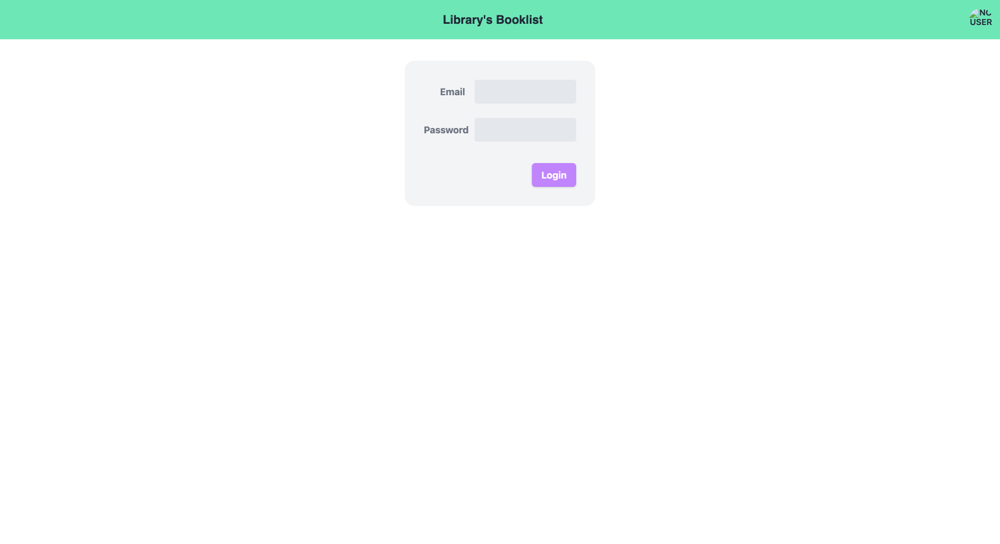
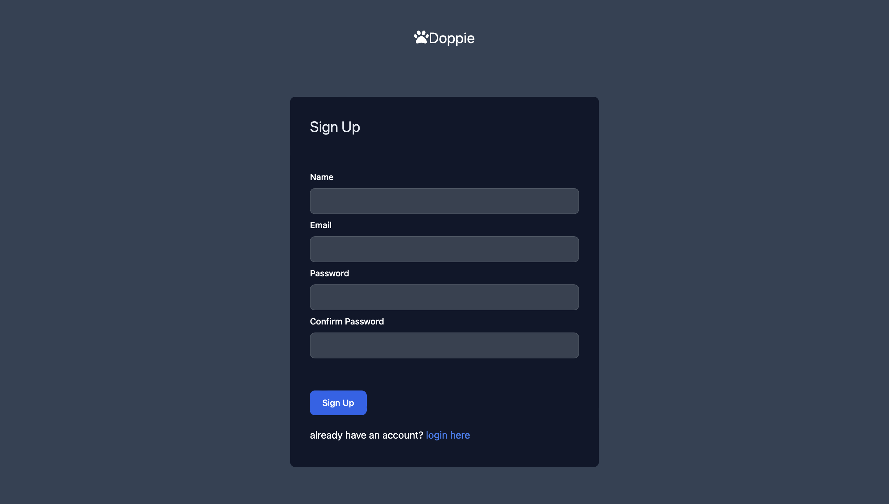
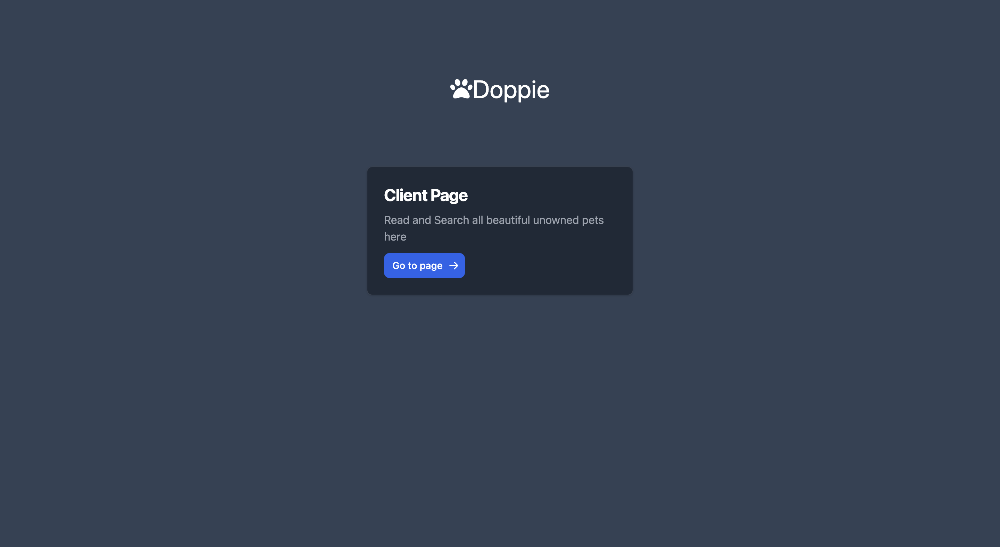
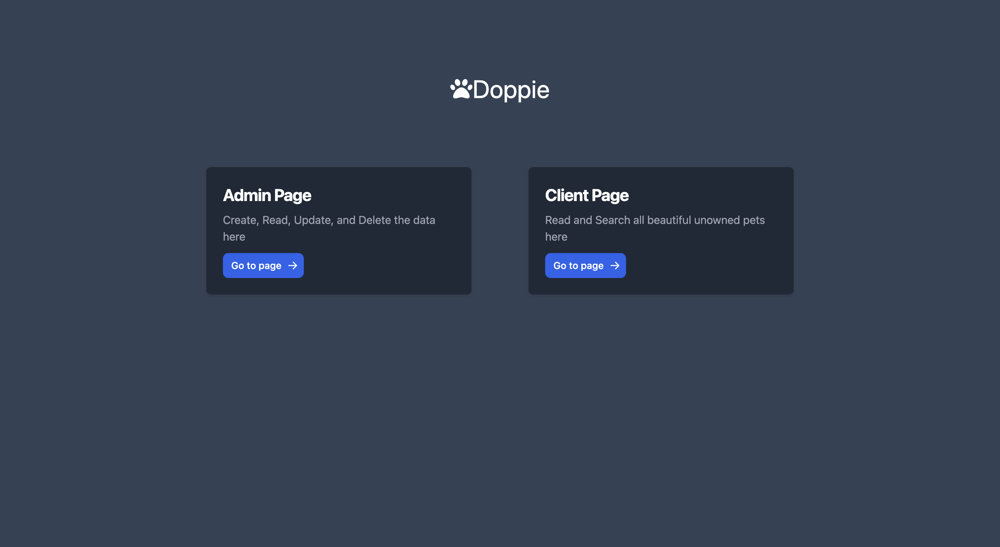
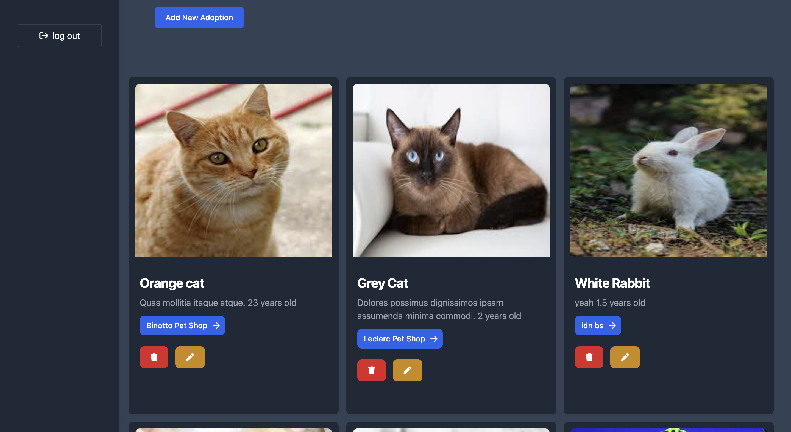
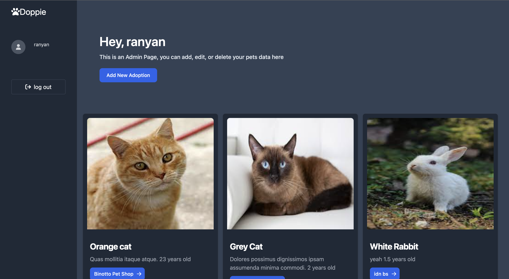
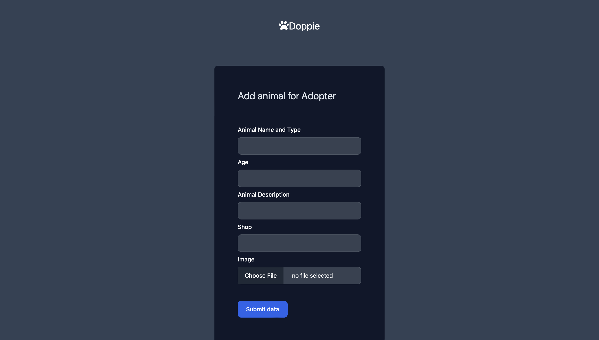
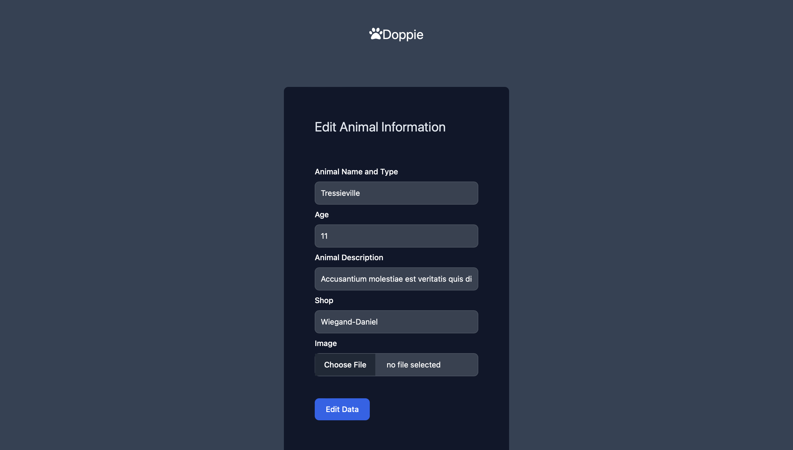
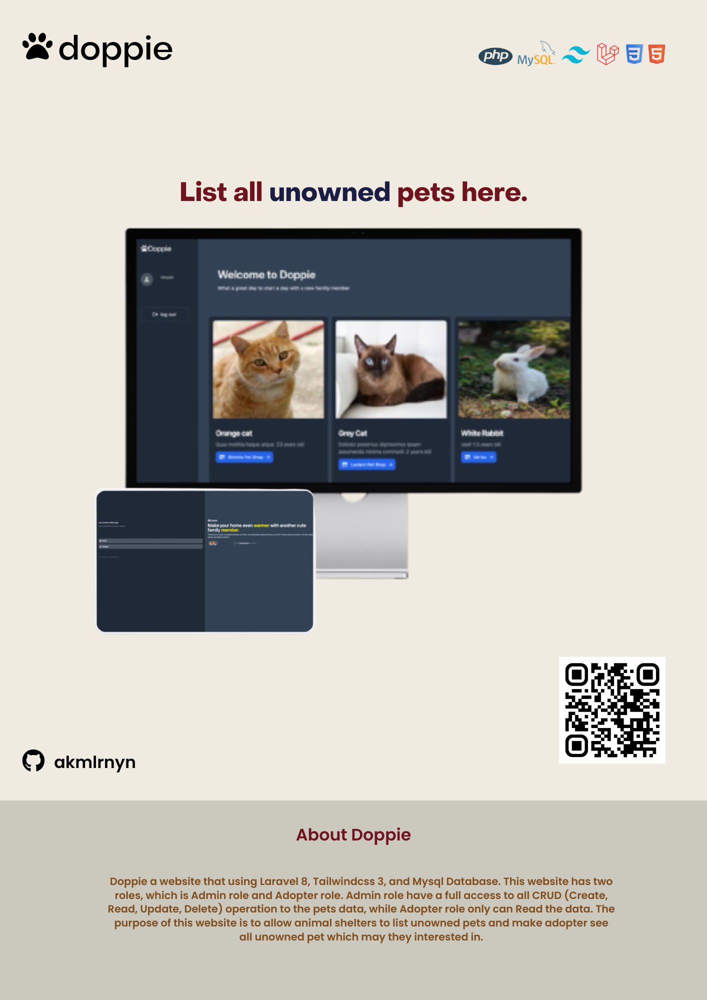

**Doppie - Pet Adoption List Project**  

### Link Website
[Task Project](task.akmalranyan.my.id). 
[Doppie](doppie.akmalranyan.my.id)

### Description 
Doppie is my first dynamic website project that using Laravel 8, Tailwindcss 3, and Mysql Database. This website has two roles, which is Admin role and Adopter role. Admin role have a full access to all CRUD (Create, Read, Update, Delete) operation to the pet data, while Adopter role only can Read the data and search the data. The purpose of this website is to allow pet shelters to list unowned pets and make adopter see all unowned pet which may they interested in.

This website has 3 main pages, which is Landing Page, Authentication Page, and Index/Home Page.
All of this website's page is Insya Allah responsive. 

### Technology Used
1. HTML
2. CSS
3. Tailwindcss 3
4. Laravel 8
6. Laravel Fortify
5. MySQL Database

### Features  
1. Admin Features. 
    a. Login Authentication with error input messages.
    b. Create, Update, and Delete the data. 
    c. Showed all pet data in index.

2. Adopter Features. 
    a. Login and Register Authentication with error input messages. 
    b. Showed all pet data in index.

## Pages
This website has 8 pages, which is Landing Page, Login Page, Register Page, Middle Page, Home-admin Page, Home-client Page, Create Page, and Update Page.

1. Landing Page

2. Login Page

3. Register Page

4. Middle Page

5. Middle Page Admin

6. Home Page Admin

7. Home Page Client

8. Create Page

9. Update Page

## Poster

## Copyright
Created by Akmal Faiq Muhammad Ranyan

