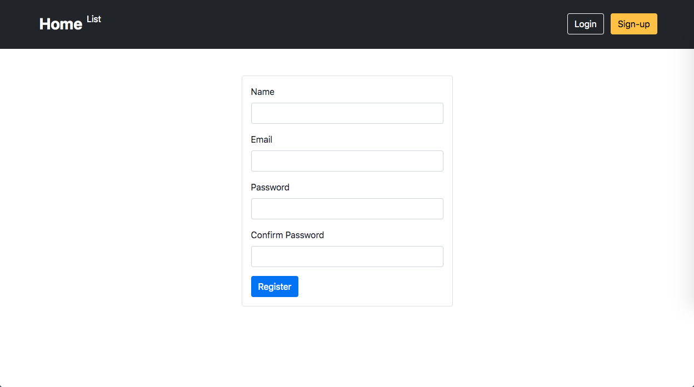
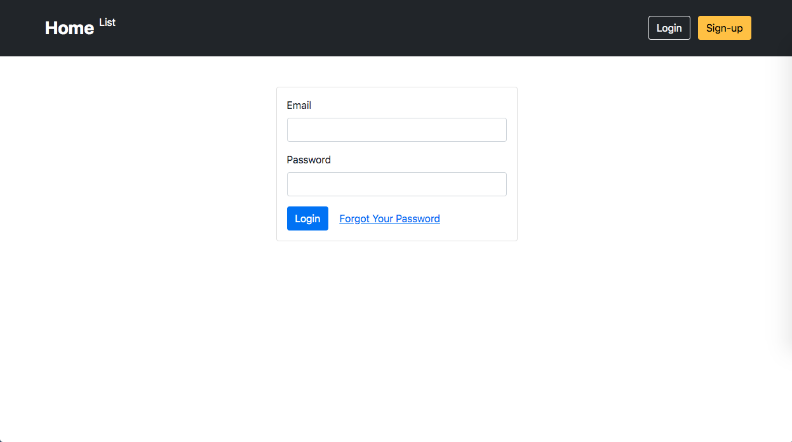
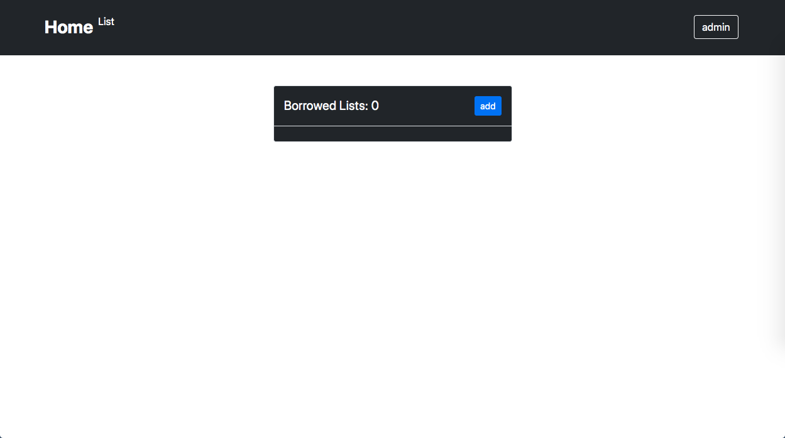
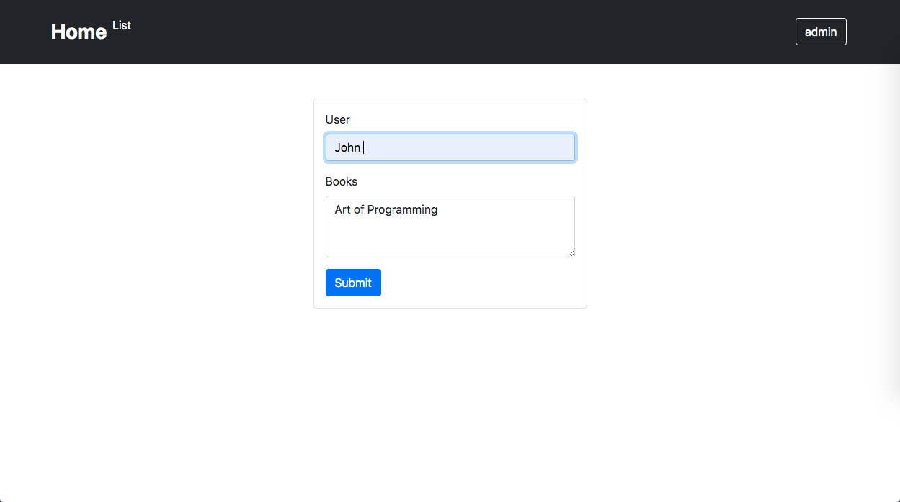
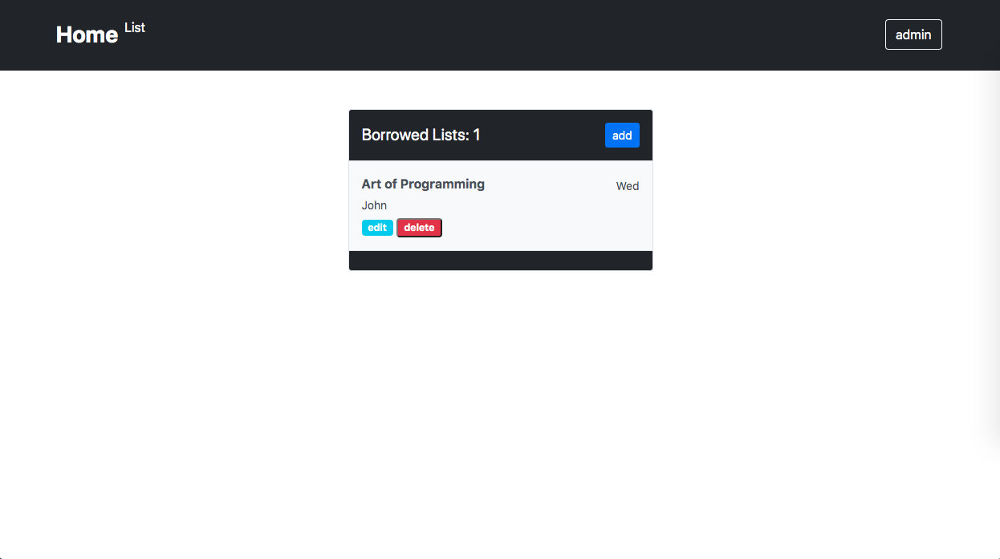

# LibaryManagements 🔖

Hello everyone!, this project is one of my school project. <b style="color:white;">Libary Management</b> will manage a data if someone borrow some books from the libary.

## Technology used in this project

1. **Laravel**
2. **Bootstrap**
3. **HTML**
4. **CSS**

## Here's some feature

1. Can do **CRUD** Function in the website
2. Only Admin can **add , edit , delete** the data
3. User can only view the listed book
4. There is **Register , Login , Logout** function

## Preview

this is the preview of the **register page** in this page you can make a new user for the website.

this is the preview of the **login page** in this page if you already have an account you can go to this page.

and after you already login / register you will redicted to **Home Page** and you can see the book that are borrowed here. *(**if you an admin you can add a data , if a user you only can see the data**)*

Image preview when adding data, you can input **User** and **Books** that are borrowed.

And after you add an data, You can edit it or delete it *(**Only admin!**)*.

